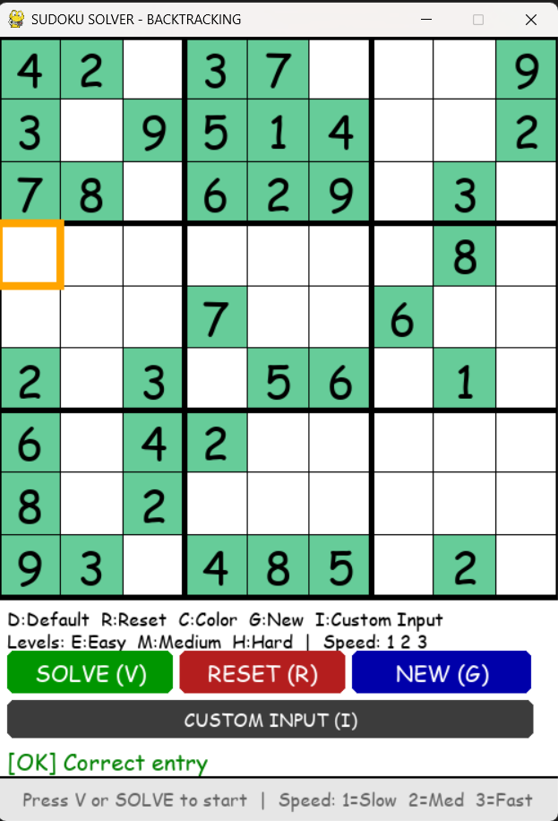
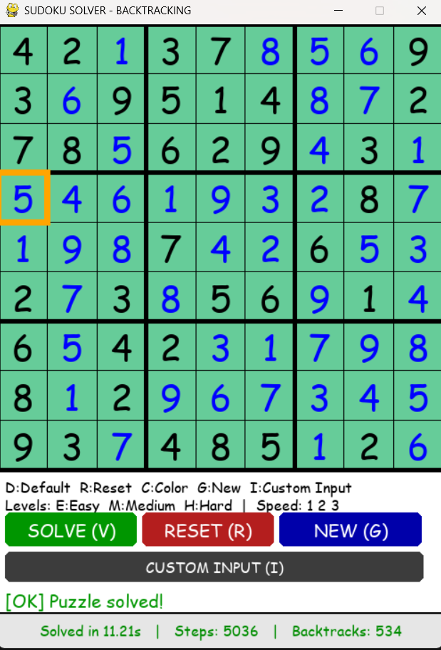
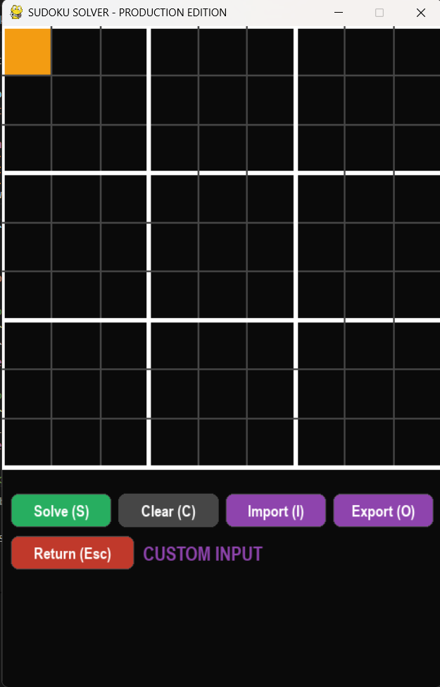
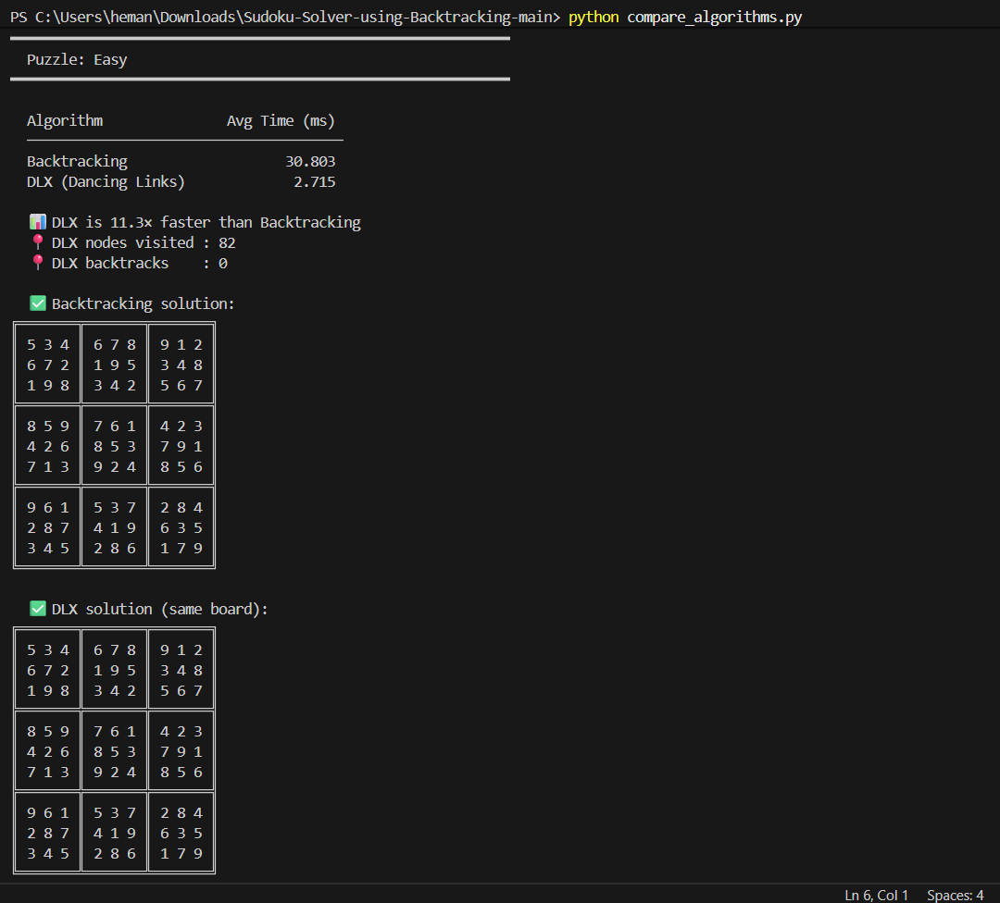
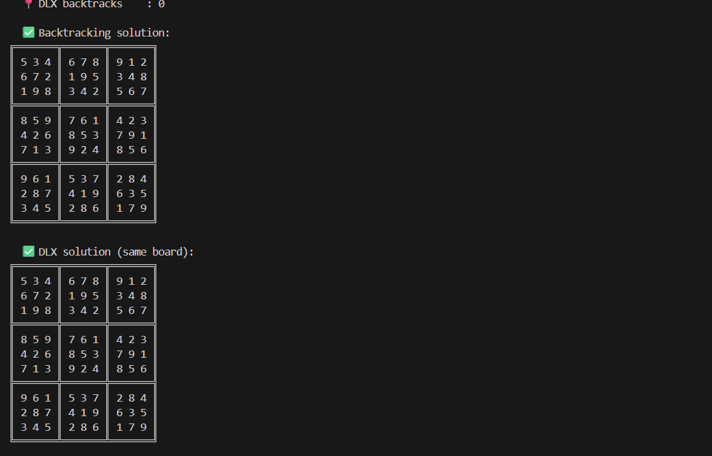
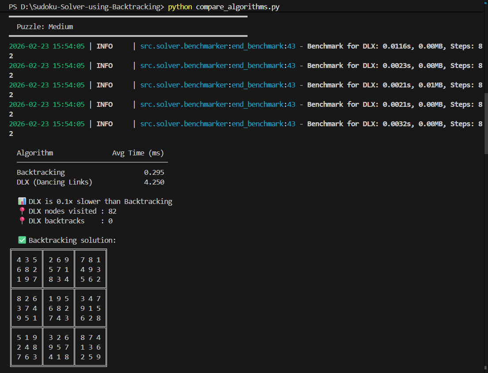
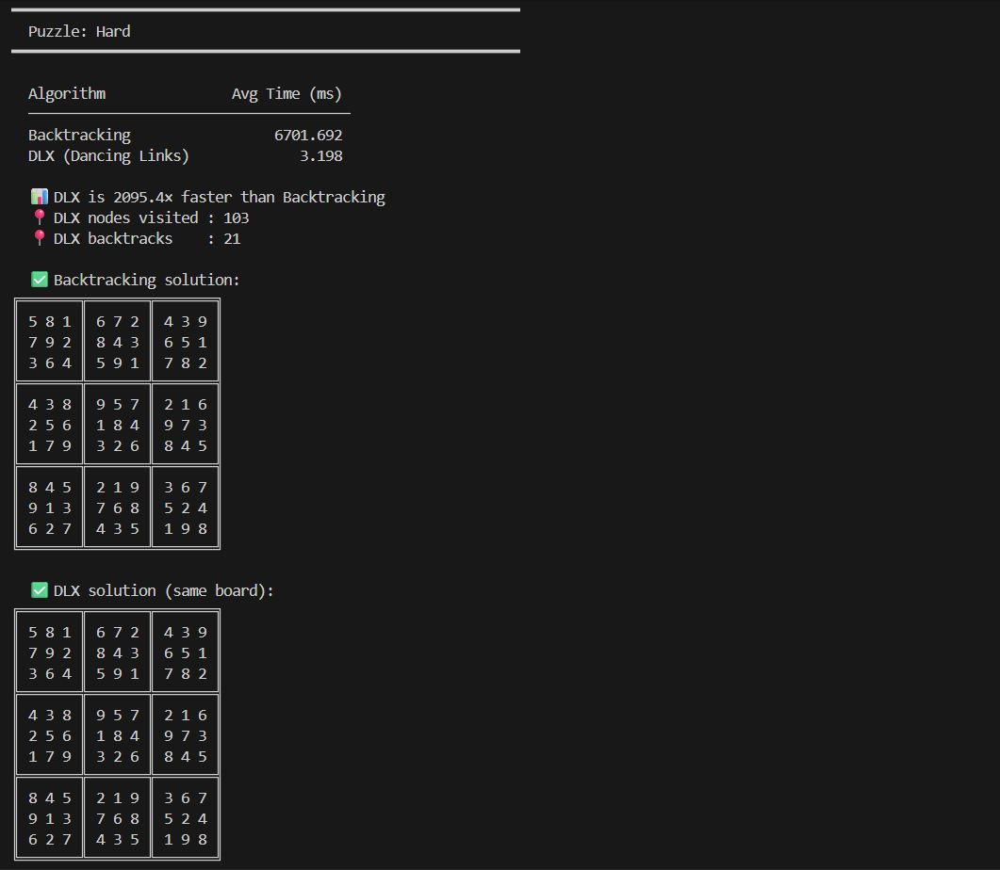
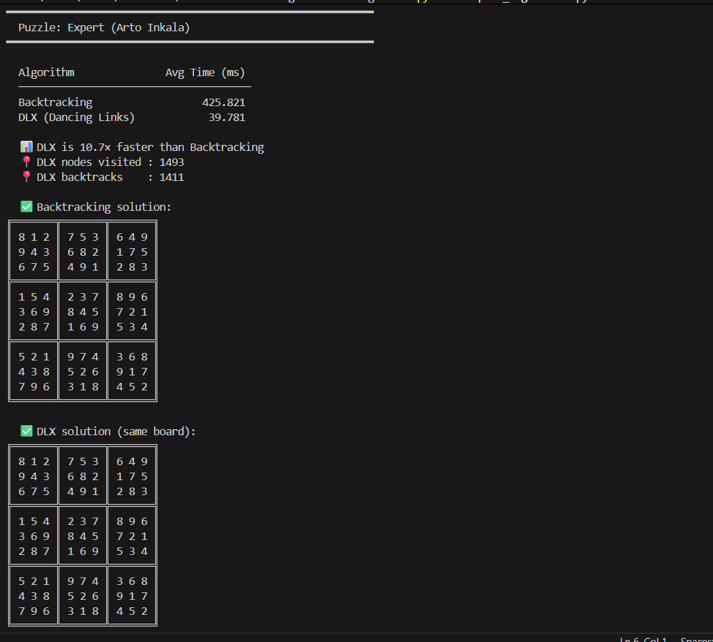
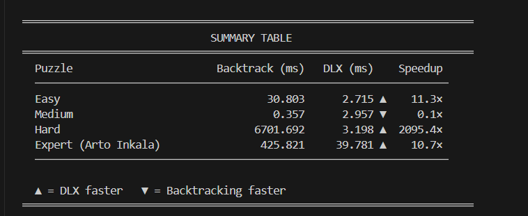

# 🧩 Sudoku Solver using Backtracking with Visualization (DSA Project)

## 📌 Project Overview

This project implements a **Sudoku Solver using the Backtracking algorithm**, a fundamental concept in Data Structures and Algorithms (DSA). The system automatically solves a given 9×9 Sudoku puzzle by filling empty cells while satisfying all Sudoku constraints.

The solver demonstrates recursion, constraint satisfaction, and efficient search space exploration. It also provides step-by-step visualization of the solving process, performance analysis, and interactive puzzle input, making it both an algorithmic and application-based implementation.

---

## 🎯 Objectives

* Implement Sudoku solving using the backtracking algorithm.
* Demonstrate recursion and constraint satisfaction techniques.
* Visualize algorithm execution step-by-step.
* Analyze solver performance using metrics.
* Provide an interactive user interface for puzzle solving.

---

## ⚙️ Technologies Used

* **Python**
* **Backtracking Algorithm**
* **Recursion**
* **Pygame (GUI Visualization)**
* **Matrix / 2D Array Operations**
* **Constraint Checking**

---

## 🧠 Algorithm Used — Backtracking

Backtracking is a recursive problem-solving technique that explores possible solutions and eliminates invalid ones.

Sudoku is a **constraint satisfaction problem**, where valid states must satisfy row, column, and subgrid constraints.

### Working Steps

1. Find an empty cell in the Sudoku grid.
2. Try numbers from 1 to 9.
3. Check if the number satisfies Sudoku rules.
4. Place the number if valid.
5. Recursively solve remaining cells.
6. If no valid solution exists, backtrack and try another value.

---

## 🧠 Data Structures Used

* **2D Matrix** → Sudoku grid representation.
* **Recursion Stack** → Function calls during backtracking.
* **Constraint Checking Methods** → Validate row, column, and subgrid rules.

---

## ⭐ Features

### 🔄 Step-by-Step Solving Visualization

* Highlights current cell being solved.
* Shows number placement animation.
* Displays backtracking process.
* Adjustable solving speed (slow/medium/fast).

### 📊 Performance Metrics

* Counts recursive calls.
* Tracks number of backtracking steps.
* Measures total solving time.
* Displays metrics after solving.

### ✏️ Custom Puzzle Input

* User can manually enter Sudoku values.
* Accepts values from 1–9.
* Empty cells represented as `0`.
* Validates user input before solving.

### 🔍 Constraint Validation

* Row validation
* Column validation
* 3×3 subgrid validation

### ⚡ Efficient Search

* Reduces unnecessary computation.
* Systematically explores valid solutions.

---

## 📝 Input Format

* Sudoku puzzle is represented as a **9×9 grid**.
* Empty cells are represented using `0`.
* The solver fills all empty cells while satisfying Sudoku constraints.

---

## 📊 Time and Space Complexity

### Time Complexity

**Worst Case:** O(9^81)

Each empty cell can take values from 1–9, leading to exponential search space. Backtracking prunes invalid paths early.

### Space Complexity

**O(n²)** due to board storage and recursion stack.

---

## ▶️ How to Run the Project

### Install Dependencies

```bash
pip install pygame
```

### Run the Application

```bash
python main.py
```

---

## 📂 Project Structure

```
Sudoku-Solver/
│
├── src/
│   ├── solver/        # Backtracking solver logic
│   ├── gui/           # GUI implementation
│   └── utils/         # Helper functions
│
├── assets/images/     # Icons and images
├── docs/              # Documentation / presentation
├── main.py            # Entry point
├── README.md
└── requirements.txt
```
## 📸 Example Input











---

## 🌍 Applications

* Puzzle solving systems
* Constraint satisfaction problems
* AI problem-solving techniques
* Game development
* Scheduling and optimization systems

---

## ⚠️ Limitations

* Designed mainly for 9×9 Sudoku puzzles.
* Performance depends on puzzle complexity.

---

## 🚀 Future Improvements

* Support for different grid sizes.
* Advanced heuristics (MRV, forward checking).
* Web-based Sudoku interface.
* Performance comparison between multiple algorithms.

---

## 👨‍💻 Author

**Hemanth Gudi**
