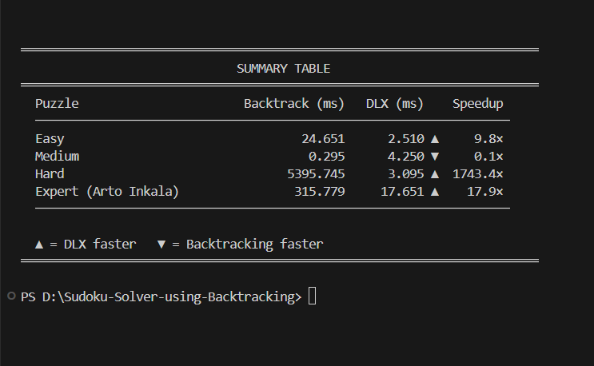

# 🧩 Sudoku Solver — Production Edition (DSA Project)


A **production-level Sudoku Solver** built using **Backtracking and Dancing Links (DLX)** algorithms with step-by-step visualization, performance benchmarking, and interactive GUI.

This project demonstrates core **Data Structures and Algorithms (DSA)** concepts including recursion, constraint satisfaction, optimization techniques, and efficient search space exploration with a modern software architecture.

---

## ⭐ Key Features

* 🔄 Step-by-step solving visualization
* ⚡ Backtracking + DLX algorithm support
* 📊 Performance benchmarking (time, memory, steps, backtracks)
* 🔬 Algorithm comparison (Backtracking vs DLX)
* ✏️ Custom puzzle input
* 🎨 Modern production UI with theme support
* 🔍 Constraint validation (row, column, subgrid)
* 🧪 Unit testing support
* 🌐 FastAPI backend API
* 🐳 Docker deployment ready
* 📝 Logging and configuration management

---

## 📌 Project Overview

This project implements a Sudoku Solver that automatically solves a given 9×9 puzzle while satisfying all Sudoku constraints.

The system demonstrates:

* Recursion and backtracking techniques
* Constraint satisfaction problem solving
* Algorithm visualization
* Performance measurement and benchmarking
* Algorithm comparison (Backtracking vs DLX)
* Interactive user interface

It combines theoretical algorithm concepts with real-world application design.

---

## 🚀 Quick Start

### Clone Repository

```
git clone <your-repo-url>
cd sudoku-solver
```

### Install Dependencies

```
pip install -r requirements.txt
```

### Run Application (GUI)

```
python main.py
```

### Run API Server

```
uvicorn src.api.main:app --reload
```

### Run Tests

```
pytest
```

---

## 📸 Demo

### Solver Interface


```
assets/images/solver.png
```

### Custom Puzzle Input


```
assets/images/input.png
```

### Performance Benchmark





---

## ⚙️ Technologies Used

* Python
* Backtracking Algorithm
* Dancing Links (DLX)
* Recursion
* Pygame (GUI Visualization)
* FastAPI (API Service)
* Pytest (Testing)
* Docker (Deployment)
* Logging System
* Performance Benchmarking
* Matrix / 2D Array Operations

---

## 🧠 Algorithms Used

### Backtracking

Backtracking is a recursive problem-solving technique that explores possible solutions and eliminates invalid ones.

### Dancing Links (DLX)

DLX is an optimized algorithm for solving exact cover problems and provides faster performance for complex Sudoku puzzles.

Sudoku is a **constraint satisfaction problem** where each solution must satisfy:

* Row constraint
* Column constraint
* 3×3 subgrid constraint

---

## 🔬 Algorithm Performance Comparison

The project compares multiple solving approaches:

### Backtracking

* Recursive search
* Constraint validation
* Explores search space systematically

### Dancing Links (DLX)

* Exact cover formulation
* Optimized search
* Faster for complex puzzles

### Benchmark Metrics

* Execution time
* Memory usage
* Steps and backtracks
* Nodes visited

DLX typically provides faster performance than standard backtracking.

---

## 🧠 Data Structures Used

* **2D Matrix** → Sudoku grid representation
* **Recursion Stack** → Function calls during solving
* **Constraint Checking Functions** → Rule validation

---

## ⭐ Features in Detail

### 🔄 Visualization

* Highlights current cell
* Shows number placement
* Displays backtracking process
* Adjustable solving speed

### 📊 Performance Metrics

* Counts recursive calls
* Tracks backtracking steps
* Measures execution time
* Displays solving statistics

### ✏️ Custom Puzzle Input

* Manual puzzle entry
* Accepts values 1–9
* Empty cells represented as 0
* Input validation with error detection

### 🔍 Constraint Validation

* Row validation
* Column validation
* 3×3 subgrid validation

---

## 📝 Input Format

* Sudoku represented as 9×9 grid
* Empty cells represented using `0`
* Solver fills all empty cells while maintaining constraints

---

## 📊 Time & Space Complexity

### Time Complexity

Worst case: **O(9^(n²))** for an n×n grid.

Backtracking explores possible values but prunes invalid paths early.

### Space Complexity

**O(n²)** due to board storage and recursion stack.

---

## 📂 Project Structure

```
Sudoku-Solver/
│
├── src/
│   ├── api/           # FastAPI backend
│   ├── solver/        # Solver algorithms
│   ├── gui/           # GUI implementation
│   └── utils/         # Helper functions & configs
│
├── tests/             # Unit tests
├── assets/            # Images and icons
├── docs/              # Documentation
├── main.py            # Entry point
├── Dockerfile
├── requirements.txt
└── README.md
```

---

## 🌍 Applications

* Puzzle solving systems
* Constraint satisfaction problems
* AI problem solving
* Game development
* Scheduling and optimization systems

---

## ⚠️ Limitations

* Designed primarily for 9×9 Sudoku puzzles
* Performance varies with puzzle difficulty

---

## 🚀 Future Improvements

* Support for different grid sizes
* Advanced heuristics (MRV, forward checking)
* Web-based Sudoku interface

---

## 👨‍💻 Author

**Hemanth Gudi**
