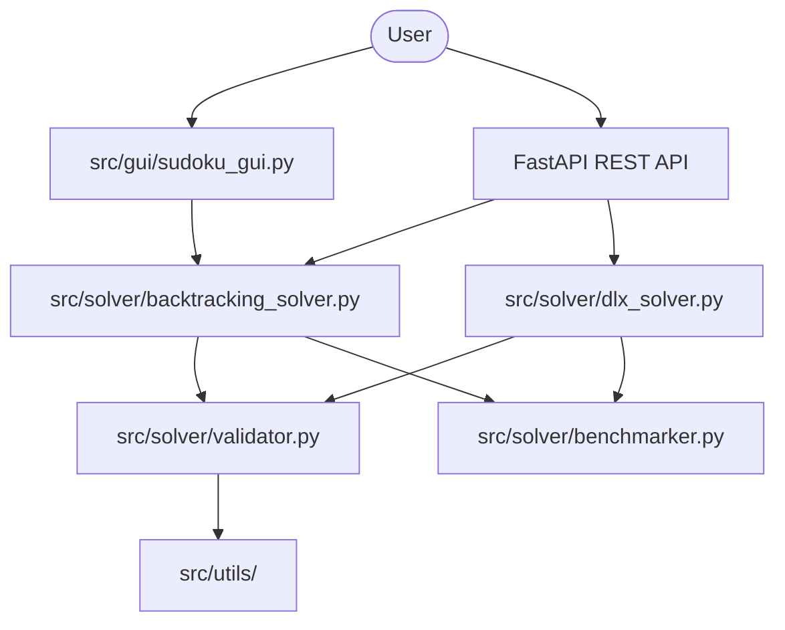

# Sudoku Solver: Production Architecture & API

This document provides a detailed overview of the project architecture, API endpoints, and performance benchmarks.

## 1. Modular Architecture

The project follows a clean, modular design to ensure scalability and maintainability.



### Key Components:
- **Core Solvers**: Optimized Backtracking and Dancing Links (DLX) implementations.
- **Validator**: Centralized logic for Sudoku rule enforcement.
- **Benchmarker**: Tracks execution time and memory usage for performance auditing.
- **FastAPI Backend**: Provides RESTful endpoints for remote solving.
- **Professional GUI**: Pygame-based interface with theme support and animations.

## 2. API Documentation

The API runs by default on `http://localhost:8000`.

### Endpoints:
| Method | Endpoint | Description |
|--------|----------|-------------|
| GET | `/api/v1/health` | Service health status |
| POST | `/api/v1/solve/backtracking` | Solve using Backtracking |
| POST | `/api/v1/solve/dlx` | Solve using DLX (Recommended) |

### Request Sample:
```json
{
  "board": [[5,3,0,...], ...]
}
```

## 3. Performance Benchmarks

Typical solving times on modern hardware:

| Algorithm | Difficulty | Time (ms) | Steps / Nodes |
|-----------|------------|-----------|---------------|
| Backtracking | Medium | ~50-200 | 2,000 - 10,000 |
| DLX | Medium | ~1-5 | 100 - 500 |
| DLX | Hard | ~5-15 | 200 - 1,000 |

## 4. Deployment

### Docker
```bash
docker-compose up --build
```

### Production Best Practices
- **Structured Logging**: All logs are saved to `logs/sudoku_solver.log`.
- **Validation**: Strict input validation before any solver execution.
- **Health Checks**: Automated monitoring via `/health` endpoint.
